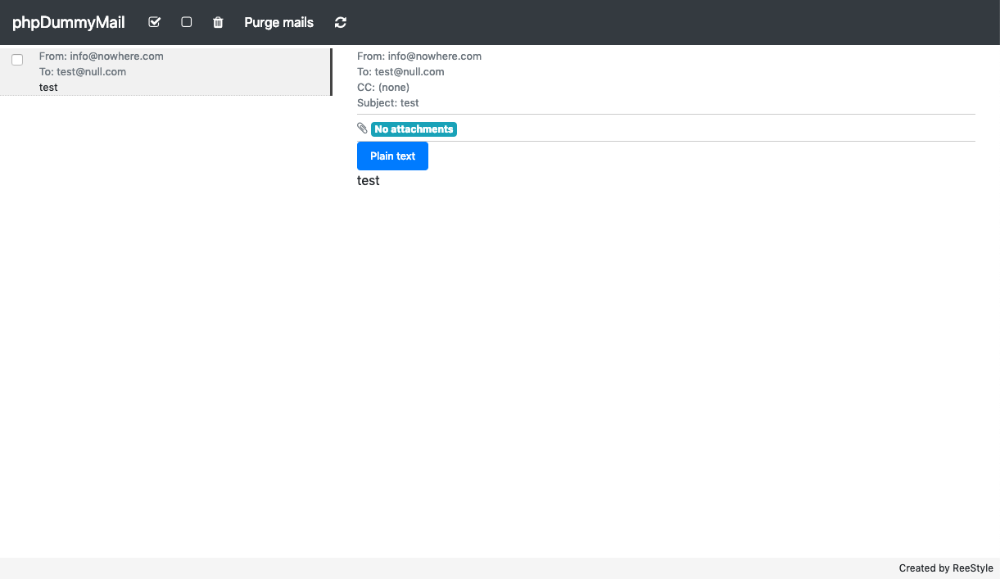

# Usage

Prerequisites:
- PHP5.6+ - It is PHP5.6 and PHP7 compatible: We use the Class::class which is only present in 
versions from PHP5.6 on
- Composer
- \[path_to_phpdummymail]/mails/ and \[path_to_phpdummymail]/logs/ folders should be writable 
for the web service (www-data on debian)  

Installation is simple:
- Unpack (or clone with git) into a folder 
- Run 'composer install' (DO NOT run 'composer update'!)
- Edit your php.ini (both CGI and CLI!) and edit the following line:
    - sendmail_path = \[path_to_phpdummymail]/receiver.php
- Restart web service if necessary (e.g. apache fpm need to)
- Run: php tester.php
- Create an alias to the \[path_to_phpdummymail]/htdocs/ in your 
apache config (or whatever flavor webservice you're using)
and set index.php as primary file to invoke
- Edit htdocs/config/config.php and replace '/phpdummymail' with the alias you used. You 
may alter the other configuration items at your own risk. 
  
Usage:
- Within your browser go to the alias you just created
- It should already work 
- Hit the refresh button to update mails

Done, it should already be running. The interface should be pretty self-explanatory. 

# License

Use and distribution of this software requires you to abide these simple rules:

This software 'FREE' and I want it to stay 'FREE': Free of use and distribution.

You are not granted to:
- the privilege to charge others for the use this software, other than for support or initial installation. A man (or woman) has to make a living.

You are granted to:
- the freedom to use this and/or its components in whatever product 
you wish create; I also grant you the freedom to take this software, change it 
into anything you like; As long as you do NOT charge any entity, whether a business
or real person, for the use of this software. 
- the freedom to request or demand a fee for the part that you created
yourself - whether 'you' are an entity such as a company or a real person.

You must:
-  Always include the full bundle, leave no part out

You cannot:
- hold me responsible for any damage, monetary or otherwise, when something 
goes wrong while you, in any way, use this software. 

**Important:** The application uses Composer, jQuery, Bootstrap, FontAwesome and BootBox.
These packages have their own license form. Please abide by them! 

# Other info
If you wish to:
- participate in the project, feel free to do so by forking.
- donate to the project, you can transfer the funds to my PayPal account.

**Important notice**
Remember that this software is primarily aimed at development enthusiasts that need
a simple mail catching tool to see what their application produces after it's sent,
given that your application is able to use the internal mail() function.

# Screenshot(s)

# Lastly

Have fun!
